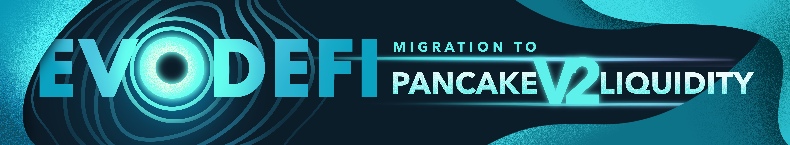

## What is Evo DeFi?

[Evo DeFi](https://evodefi.com/) is a long term sustainable Multi-Chain yield farm that allows its users to earn interest on the tokens / LPs they stake. 

Evo DeFi has multiple different features that make it unique:
1. Cross-chain token bridge for $USDC $ETH and $GenX
2. NFTs that boost your APR, giving them each an intrinsic value
3. NFT Monster Battles where you can win real $ prizes!

## What is $GenX?

$GenX is the native token of Evo DeFi across all chains. Our holders can bridge their $GenX to any of the chains that we operate on. To learn more about the chains we operate on go [here](chains.md).
