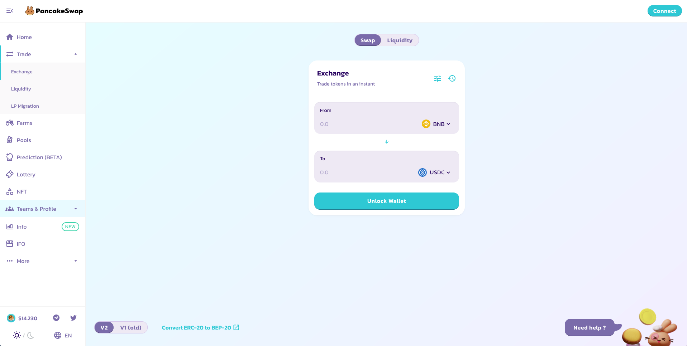
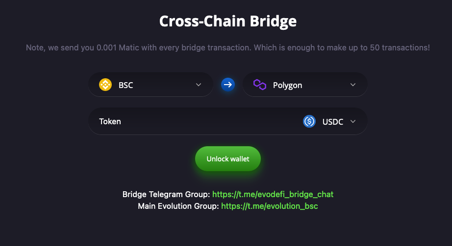
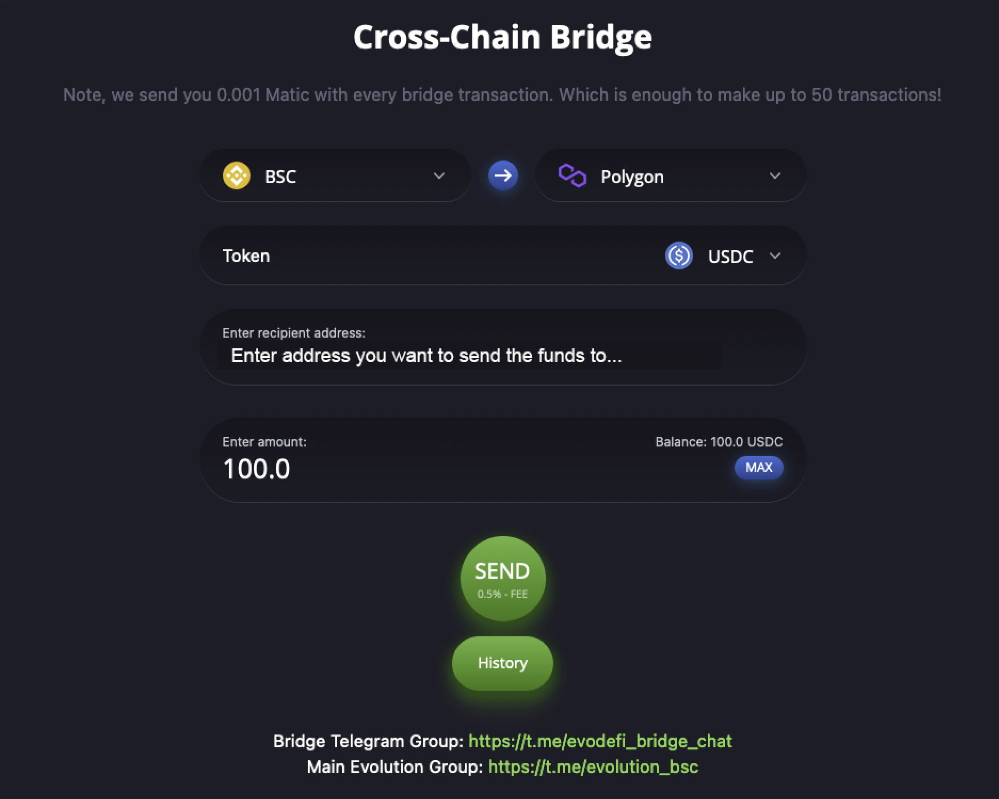
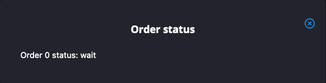

# How to transfer $USDC between chains

Here we will walk you through how to bridge $USDC from Binance Smart Chain to Polygon. The process is the same for any of the different routes you want to take, but we built this guide based on #BSC because that is where we started!

## BSC -> Polygon

#### 1. Ensure you have $USDC on your wallet in BSC 

The $USDC token address on BSC is -> 0x8ac76a51cc950d9822d68b83fe1ad97b32cd580d. If you haven't got any USDC then you can swap other tokens to USDC here: [https://exchange.pancakeswap.finance](https://exchange.pancakeswap.finance/#/swap?outputCurrency=0x8ac76a51cc950d9822d68b83fe1ad97b32cd580d)

#### 2. Navigate to the Evo DeFi bridge page and  

The bridge website is: [https://bridge.evodefi.com/?token=USDC](https://bridge.evodefi.com/?token=USDC)

This will bring up the below page, click unlock wallet and then ensure your wallet is connected.

Once your wallet is connected, it will  show you the below page where you need to enter the wallet address that you want to send the $USDC to.
It will default the wallet address to your current wallet address as by default you will have the same address on Matic as you for for BSC.

You will then get a pop-up with the Order Status, Sometimes this will get stuck on "Wait" but that is fine. You should connect your wallet to the Polygon network and you should see your $USDC tokens immediately:

To find your $USDC tokens you need to navigate to the correct block explorer:

BSC: [https://bscscan.com/token/0x8ac76a51cc950d9822d68b83fe1ad97b32cd580d](https://bscscan.com/token/0x8ac76a51cc950d9822d68b83fe1ad97b32cd580d)

Polygon: [https://polygonscan.com/token/0x2791Bca1f2de4661ED88A30C99A7a9449Aa84174](https://polygonscan.com/token/0x2791Bca1f2de4661ED88A30C99A7a9449Aa84174)

Fantom: [https://ftmscan.com/token/0x04068da6c83afcfa0e13ba15a6696662335d5b75](https://ftmscan.com/token/0x04068da6c83afcfa0e13ba15a6696662335d5b75)

HECO: [https://hecoinfo.com/token/0x9362bbef4b8313a8aa9f0c9808b80577aa26b73b](https://hecoinfo.com/token/0x9362bbef4b8313a8aa9f0c9808b80577aa26b73b)

Here you will find your transferred tokens, minus the 0.5% fee.

